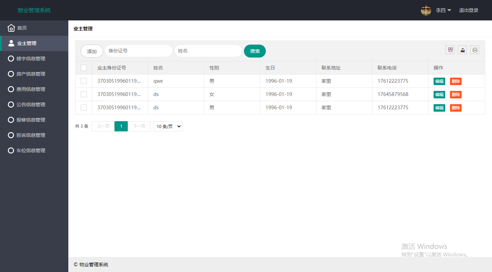
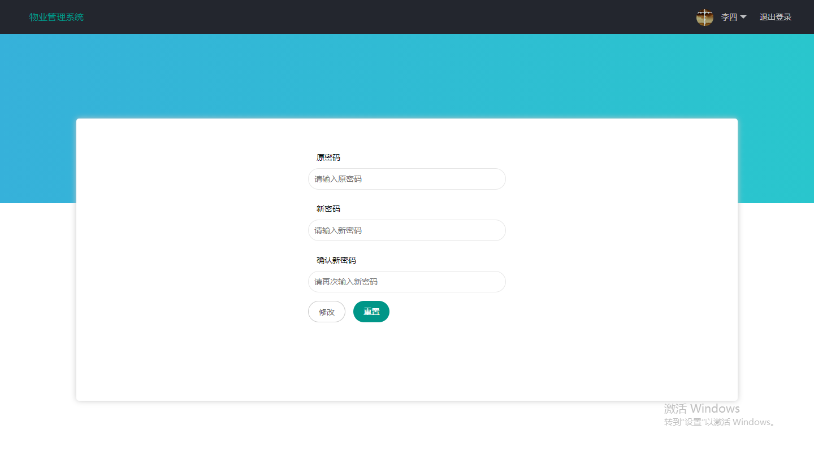
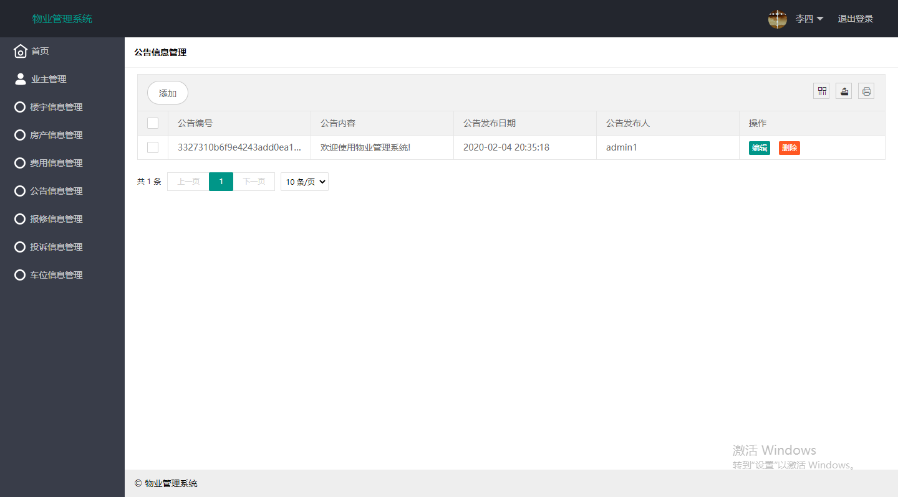
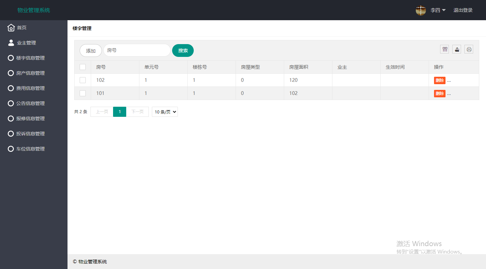
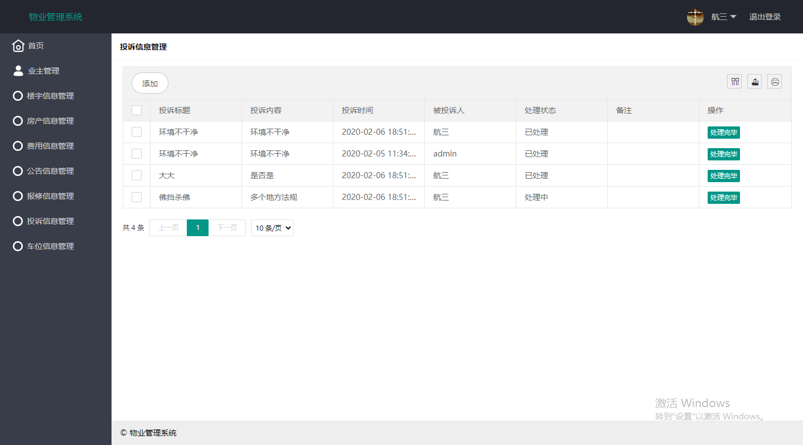
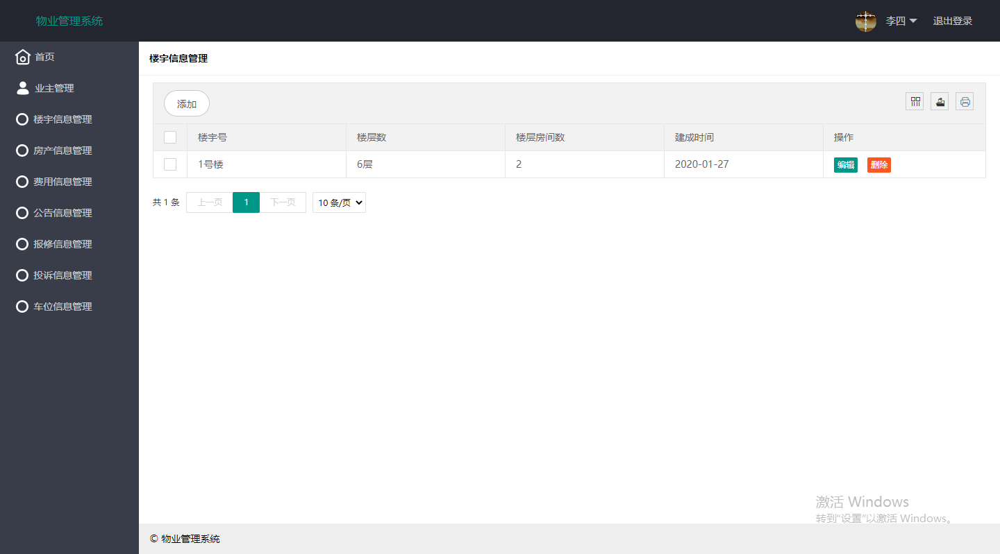
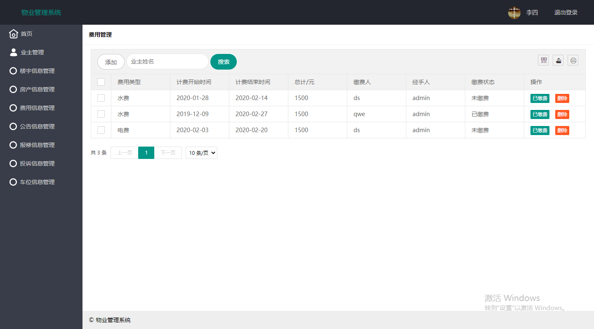
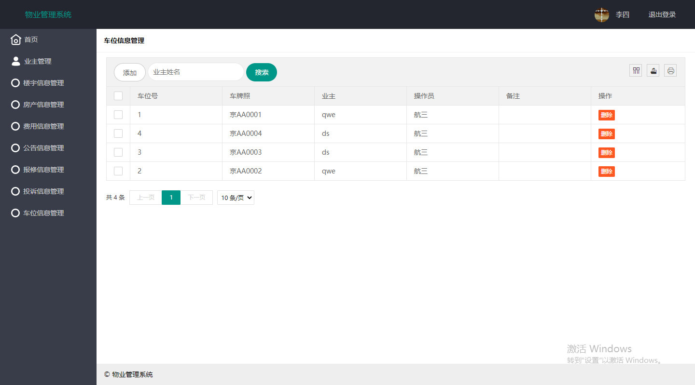

本项目是基于ssm+layui的小区物业管理系统

项目代码已收录公众号【java项目源码】，需要请自行关注一下公众号并下载源码

分为二种用户：

1.超级管理员：操作普通管理员

2.普通管理员：业主管理，楼宇信息管理，房产信息管理，费用信息管理，公告信息管理，保修信息管理，
投诉信息管理，车位信息管理 以及修改密码

对应页面：
1、超级管理员登陆地址：\admin    用户名：admin 密码：12345678

2、平台管理员登陆地址：\login	 
用户名：数据库表manager    
初始密码：123456

本项目建议使用idea运行（只是建议）

CSDN博客地址：[基于ssm+layui的小区物业管理系统](https://blog.csdn.net/mataodehtml/article/details/112973326)

运行视频地址：[基于ssm+layui的小区物业管理系统](https://www.bilibili.com/video/BV17K4y1H72R)

