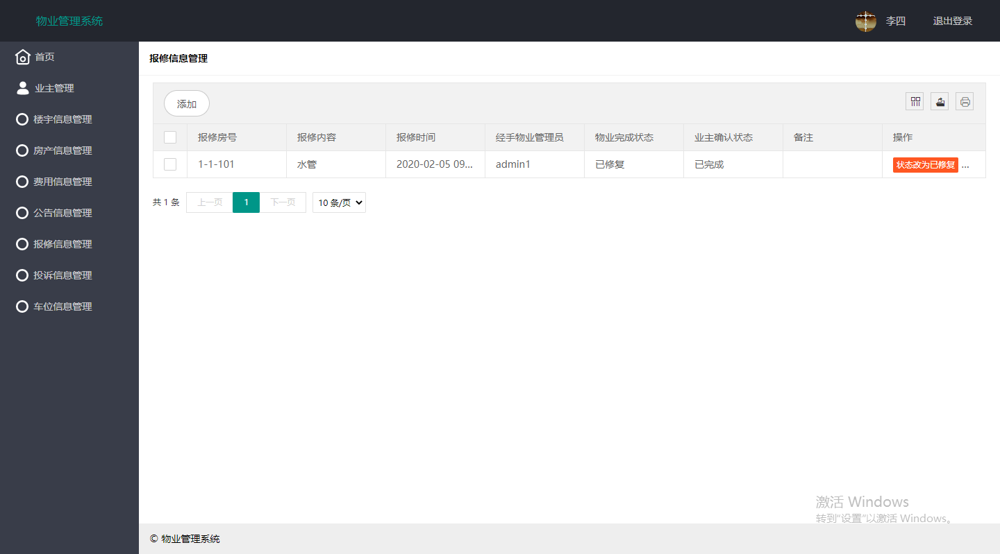

本项目是基于ssm+layui的小区物业管理系统

源码下载：http://www.manoncode.cn/details?id=9

CSDN博客地址：https://blog.csdn.net/mataodehtml/article/details/112973326

分为二种用户：

1.超级管理员：操作普通管理员

2.普通管理员：业主管理，楼宇信息管理，房产信息管理，费用信息管理，公告信息管理，保修信息管理，
投诉信息管理，车位信息管理 以及修改密码

对应页面：
1、超级管理员登陆地址：\admin    用户名：admin 密码：12345678

2、平台管理员登陆地址：\login	 
用户名：数据库表manager    
初始密码：123456

本项目建议使用idea运行（只是建议）

